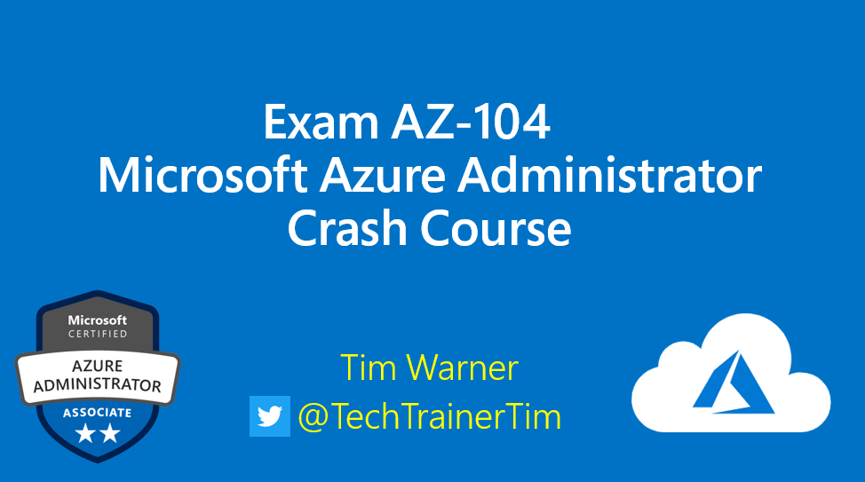

<h1 align="center">
  <a href="https://github.com/timothywarner/az104">
    <!-- Please provide path to your logo here -->
    
  </a>
</h1>

  Exam AZ-104 - Microsoft Azure Administrator Crash Course
   
  <a href="#about"><strong>Explore the docs »</strong></a>
   
   
  <a href="https://github.com/timothywarner/az104/issues/new?assignees=&labels=bug&template=01_BUG_REPORT.md&title=bug%3A+">Report a Bug</a>
  ·
  <a href="https://github.com/timothywarner/az104/issues/new?assignees=&labels=enhancement&template=02_FEATURE_REQUEST.md&title=feat%3A+">Request a Feature</a>
  .<a href="https://github.com/timothywarner/az104/discussions">Ask a Question</a>

 

Table of Contents

- [About](#about)
  - [Built With](#built-with)
- [Roadmap](#roadmap)
- [Support](#support)
- [Project assistance](#project-assistance)
- [Contributing](#contributing)
- [Authors & contributors](#authors--contributors)
- [Security](#security)
- [License](#license)
- [Acknowledgements](#acknowledgements)

---

## About

This is a six-hour instructor-led course that covers the [Exam AZ-104, Microsoft Azure Administrator](https://docs.microsoft.com/en-us/learn/certifications/exams/az-104) certification exam objectives.

### Built With

- Microsoft Azure
- Visual Studio Code
  - PowerShell extension
  - ARM Tools extension
  - Azure CLI Tools extension
  - Azure Bicep extension
  - Azure Account extension
- Azure PowerShell
- Azure CLI
- Azure Bicep
- Azure Storage Explorer
- SQL Server Management Studio
- Microsoft PowerPoint
- Microsoft Visio
- Techsmith Snagit
- Lucidchart

## Roadmap

See the [open issues](https://github.com/timothywarner/az104/issues) for a list of proposed features (and known issues).

- [Top Feature Requests](https://github.com/timothywarner/az104/issues?q=label%3Aenhancement+is%3Aopen+sort%3Areactions-%2B1-desc) (Add your votes using the 👍 reaction)
- [Top Bugs](https://github.com/timothywarner/az104/issues?q=is%3Aissue+is%3Aopen+label%3Abug+sort%3Areactions-%2B1-desc) (Add your votes using the 👍 reaction)
- [Newest Bugs](https://github.com/timothywarner/az104/issues?q=is%3Aopen+is%3Aissue+label%3Abug)

## Support

Reach out to the maintainer at one of the following places:

- [GitHub discussions](https://github.com/timothywarner/az104/discussions)
- The email which is located [in GitHub profile](https://github.com/timothywarner)
- [Twitter](http://twitter.com/techtrainertim)
- [LinkedIn](https://www.linkedin.com/in/timothywarner)
- [Website](https://techtrainertim.com/)

## Project assistance

If you want to say **thank you** or/and support active development of Exam AZ-104 - Microsoft Azure Administrator Crash Course:

- Add a [GitHub Star](https://github.com/timothywarner/az104) to the project.
- Tweet about the Exam AZ-104 - Microsoft Azure Administrator Crash Course on your Twitter.
- Write interesting articles about the project on [Dev.to](https://dev.to/), [Medium](https://medium.com/) or personal blog.

Together, we can make Exam AZ-104 - Microsoft Azure Administrator Crash Course **better**!

## Contributing

First off, thanks for taking the time to contribute! Contributions are what make the open-source community such an amazing place to learn, inspire, and create. Any contributions you make will benefit everybody else and are **greatly appreciated**.

We have set up a separate document containing our [contribution guidelines](docs/CONTRIBUTING.md).

Thank you for being involved!

## Authors & contributors

The original setup of this repository is by [Tim Warner](https://github.com/timothywarner).

For a full list of all authors and contributors, check [the contributors page](https://github.com/timothywarner/az104/contributors).

## Security

Exam AZ-104 - Microsoft Azure Administrator Crash Course follows good practices of security, but 100% security can't be granted in software.
Exam AZ-104 - Microsoft Azure Administrator Crash Course is provided **"as is"** without any **warranty**. Use at your own risk.

_For more info, please refer to the [security](docs/SECURITY.md)._

## License

This project is licensed under the **MIT license**.

See [LICENSE](LICENSE) for more information.

## Acknowledgements

Thanks to Laura Lewin, Mike Pfeiffer, Microsoft, and to each and every one of my students around the world.
