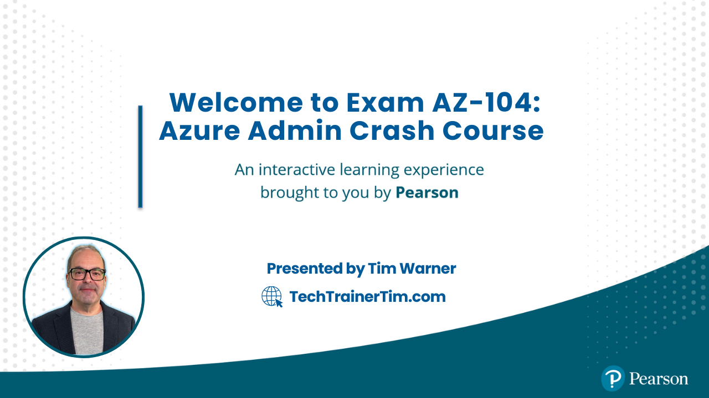

# Tim Warner's AZ-104 Study Resources

Welcome to the ultimate resource hub for preparing for the **AZ-104 Microsoft Azure Administrator Exam**. Whether you're aiming for certification or deepening your Azure knowledge, this guide is packed with the best tools, links, and tips to set you up for success.

---

## 📬 **Contact Information**
- **[Email](mailto:timothywarner316@gmail.com)**
- **[LinkedIn](https://www.linkedin.com/in/timothywarner/)**
- **[YouTube Channel](https://www.youtube.com/channel/UCim7PFtynyPuzMHtbNyYOXA)**
- **[Website](https://techtrainertim.com)**
- **[Bluesky](https://bsky.app/profile/techtrainertim.bsky.social)**
- **[Mastodon](https://mastodon.social/@techtrainertim)**

---

## 🚀 **The Good Stuff: Must-Have AZ-104 Resources**
- [AZ-104 Exam Page](https://learn.microsoft.com/en-us/certifications/exams/az-104)
- [AZ-104 Skills Measured](https://learn.microsoft.com/en-us/credentials/certifications/resources/study-guides/az-104)
- [Exam Registration (Microsoft/Pearson VUE)](https://learn.microsoft.com/en-us/credentials/certifications/schedule-through-pearson-vue?examUid=exam.AZ-104&examUrl=https%3A%2F%2Flearn.microsoft.com%2Fcredentials%2Fcertifications)
- [MeasureUp AZ-104 Practice Exams](https://www.measureup.com/microsoft-practice-test-az-104-microsoft-azure-administrator.html)
- [Microsoft Learn AZ-104 Learning Path](https://learn.microsoft.com/en-us/training/courses/az-104t00/)
- [Azure Free Account Signup](https://azure.microsoft.com/en-us/pricing/purchase-options/azure-account)
- [Pearson CertPREP AZ-104 Training Labs](https://govstore.pearsonvue.com/certprep-microsoft-exam-az-104/p/CLC-AZ104-PVUE)

---

## 📘 **Conceptual Knowledge**
These resources build your understanding of Azure fundamentals and exam concepts:
- [Azure Documentation](https://docs.microsoft.com/en-us/azure/)
- [Azure Architecture Center](https://docs.microsoft.com/en-us/azure/architecture/)
- [Azure Quickstart Templates](https://azure.microsoft.com/en-us/resources/templates/)
- [Azure SDKs and Tools](https://azure.microsoft.com/en-us/downloads/)
- [Sam Cogan ARM Tutorial](https://www.youtube.com/watch?v=9EpBiud48Ao&t=1s)
- [Adam Marczak ARM Tutorials](https://www.youtube.com/watch?v=Ge_Sp-1lWZ4&t=916s)
- [Azure Bicep Overview](https://docs.microsoft.com/en-us/azure/azure-resource-manager/bicep/overview)
- [AZ-104 Class Topology](https://lucid.app/lucidchart/5b4214cf-b00b-400d-80ff-c15572f57904/view?page=0_0#)

---

## 🛠 **Your Toolkit**
Essential tools to follow along and practice efficiently:
- **[Visual Studio Code](https://code.visualstudio.com/)**  
  Recommended extensions:
  - [PowerShell](https://marketplace.visualstudio.com/items?itemName=ms-vscode.PowerShell)
  - [Azure Account](https://marketplace.visualstudio.com/items?itemName=ms-vscode.azure-account)
  - [ARM Tools](https://marketplace.visualstudio.com/items?itemName=msazurermtools.azurerm-vscode-tools)
  - [Azure CLI Tools](https://marketplace.visualstudio.com/items?itemName=ms-vscode.azurecli)
  - [Bicep](https://marketplace.visualstudio.com/items?itemName=ms-azuretools.vscode-bicep)
- [PowerShell 7](https://learn.microsoft.com/en-us/powershell/scripting/install/installing-powershell)
- [Azure PowerShell Module](https://learn.microsoft.com/en-us/powershell/azure/install-az-ps)
- [Azure CLI](https://learn.microsoft.com/en-us/cli/azure/install-azure-cli)
- [Azure Storage Explorer](https://azure.microsoft.com/en-us/features/storage-explorer/)
- [AzCopy](https://learn.microsoft.com/en-us/azure/storage/common/storage-use-azcopy-v10)

---

## 🛡 **Practical Application**
Learn through hands-on labs and live environments:
- [Azure Free Account](https://azure.microsoft.com/en-us/free/)
- [Microsoft Learn: Azure Administrator Path](https://docs.microsoft.com/en-us/learn/browse/?roles=administrator)
- [Azure Citadel](https://azurecitadel.com/)
- [AZ-104 Microsoft Official Curriculum Labs](https://github.com/MicrosoftLearning/AZ-104-MicrosoftAzureAdministrator)
- [Azure Bicep Playground](https://learn.microsoft.com/en-us/azure/azure-resource-manager/bicep/playground)
- [Azure Log Analytics Demo Environment](https://learn.microsoft.com/en-us/azure/azure-monitor/logs/log-analytics-demo-environment)

---

## 📑 **Practice Exams**
- [Microsoft Free Practice Assessments](https://learn.microsoft.com/en-us/certifications/practice-assessments-for-microsoft-certifications)
- [MeasureUp Practice Exams](https://www.measureup.com/az-104-microsoft-azure-administrator.html)

---

## 💸 **Exam Discounts and Registration Info**
- [Microsoft Certification Special Offers](https://learn.microsoft.com/en-us/certifications/deals)
- [AZ-104 Exam Registration](https://learn.microsoft.com/en-us/credentials/certifications/exams/az-104)
- [About Online Exams](https://learn.microsoft.com/en-us/credentials/certifications/online-exams)
- [Certification Policies and FAQs](https://learn.microsoft.com/en-us/credentials/certifications/certification-exam-policies)
- [Microsoft Certification Exam Policies](https://learn.microsoft.com/en-us/certifications/certification-exam-policies)

---

## 🎥 **Tim's Helper Videos**
- [Exam Registration Walkthrough](https://www.youtube.com/watch?v=FOFWbSYbbVI)
- [Online Testing Tips](https://www.youtube.com/watch?v=myf6r5nulj0&feature=youtu.be)

---

This README is designed for maximum utility and easy navigation. If you have suggestions or corrections, feel free to reach out via the contact information above. Best of luck on your AZ-104 journey!
