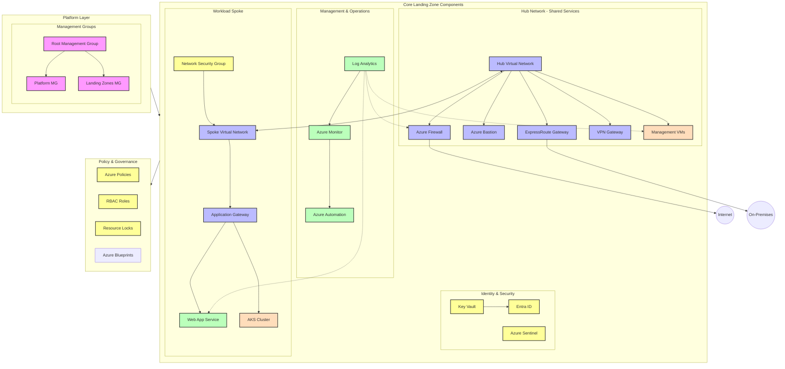

```mermaid
graph TB
    %% Platform Layer - Management Groups at Top
    subgraph Platform[Platform Layer]
        direction LR
        subgraph Management[Management Groups]
            Root[Root Management Group]
            Platform_MG[Platform MG]
            LandingZones[Landing Zones MG]
            Root --> Platform_MG
            Root --> LandingZones
        end
    end

    %% Core Enterprise Scale Landing Zone Components
    subgraph Core[Core Landing Zone Components]
        direction LR
        
        %% Left Side - Management & Identity
        subgraph Management_Ops[Management & Operations]
            LogAnalytics[Log Analytics]
            Monitor[Azure Monitor]
            Automation[Azure Automation]
            LogAnalytics --> Monitor
            Monitor --> Automation
        end

        subgraph Identity[Identity & Security]
            KeyVault[Key Vault]
            Entra[Entra ID]
            Sentinel[Azure Sentinel]
            KeyVault --> Entra
        end

        %% Center - Hub Network
        subgraph Hub[Hub Network - Shared Services]
            HubVNet[Hub Virtual Network]
            Firewall[Azure Firewall]
            Bastion[Azure Bastion]
            ExpressRoute[ExpressRoute Gateway]
            VPNGateway[VPN Gateway]
            JumpBoxes[Management VMs]
            HubVNet --> Firewall
            HubVNet --> Bastion
            HubVNet --> ExpressRoute
            HubVNet --> VPNGateway
            HubVNet --> JumpBoxes
        end

        %% Right Side - Landing Zone
        subgraph Spoke[Workload Spoke]
            SpokeVNet[Spoke Virtual Network]
            AppGateway[Application Gateway]
            WebApp[Web App Service]
            AKS[AKS Cluster]
            NSG[Network Security Group]
            SpokeVNet --> AppGateway
            AppGateway --> WebApp
            AppGateway --> AKS
            NSG --> SpokeVNet
        end
    end

    %% Bottom - Policy & Governance
    subgraph Policy[Policy & Governance]
        direction LR
        Policies[Azure Policies]
        RBAC[RBAC Roles]
        ResourceLocks[Resource Locks]
        Blueprints[Azure Blueprints]
    end

    %% Key Connections
    Platform --> Core
    Core --> Policy
    HubVNet <--> SpokeVNet
    LogAnalytics -.-> WebApp
    LogAnalytics -.-> Firewall
    LogAnalytics -.-> JumpBoxes
    Firewall --> Internet((Internet))
    ExpressRoute --> OnPrem((On-Premises))

    %% Styling
    classDef mgmt fill:#f9f,stroke:#333,stroke-width:2px
    classDef network fill:#bbf,stroke:#333,stroke-width:2px
    classDef security fill:#ff9,stroke:#333,stroke-width:2px
    classDef monitoring fill:#bfb,stroke:#333,stroke-width:2px
    classDef compute fill:#fdb,stroke:#333,stroke-width:2px
    
    class Root,Platform_MG,LandingZones mgmt
    class HubVNet,SpokeVNet,Firewall,Bastion,AppGateway,ExpressRoute,VPNGateway network
    class KeyVault,NSG,Policies,RBAC,ResourceLocks,Entra,Sentinel security
    class LogAnalytics,Monitor,Automation,WebApp monitoring
    class JumpBoxes,AKS compute
``` 